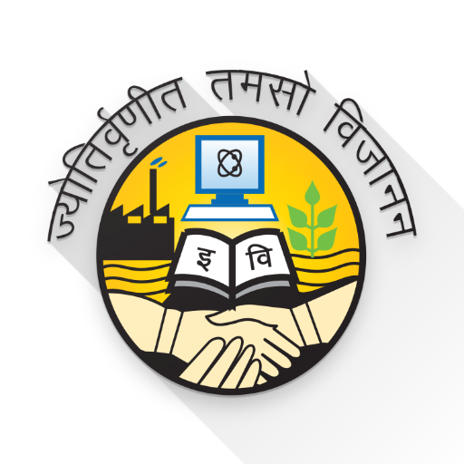
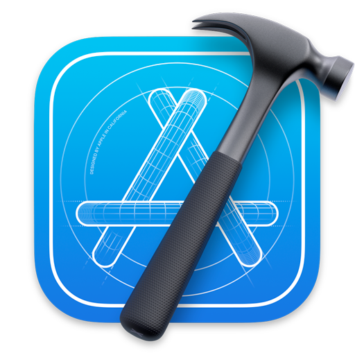

<!-- <h1 align="center">Hi, Myself Priyam Garg  ! </h1> -->

<!-- <h3 align="center">Software Developer | Data Analyst </h3> -->

    <b><i align="center">"I am not stupid, Just too lazy to show how smart I am”</i></b>

I am a <em><b><i align="center">A Passionate Learner</b>👨🏻‍💻 and a <b>Sophophile📚 </i></b></em> I will graduate with Master's in <em>Computer Science</em> from <b>North Carolina State University, Raleigh </b> in May 2023. Currently, I am working as <em>Software Engineering Intern</em> at <b>Zscaler</b> in the R&D team of the ZPA tool. Find my resume <a href="https://drive.google.com/file/d/1OyVBGgT4MugE54KpA3Y5XK0Tmubgyqr1/view?usp=drivesdk">here</a>

# 📚 Education
<h2>  <b>North Carolina State University, Raleigh, NC </b> | <em> Master of Computer Science</em> </h2> 
<h5> 
 Aug 2021 - Present
 </h5>

### Courses
1. Design and Analysis of Algorithms
2. Internet Protocols
3. Automated Data Learning Analysis
4. Internet of Things: Architectures, Applications, and Implementation
5. Object-Oriented Design and Development
6. Algorithms for Data Guided Business Intelligence.

### Open Source Contributions
***Expertiza***: Enhanced the application by implementing the Suggestion Detection Algorithm in the current codebase, which will help reviewers get live feedback for the review provided.

<h2>  <b>Guru Gobind Singh Indraprastha University, Delhi, India </b> | <em> B.Tech in Computer Science and Engineering</em> </h2> 
<h5> 
 Aug 2016 - Aug 2020
 </h5>

###  Activities and Societies 
- Core member of the Research and Development Lab of Computer Science & Engineering Department. My areas of research include Application of Computer Vision and Deep Learning methods like Evolutionary Algorithms and Nature Inspired Algorithms in Healthcare.
- Coordinating juniors to work on innovative research projects by helping them in their endeavours. 
Presented a Research Paper in International Conference on Smart Sustainable Intelligent Computing and Application (ICITETM-2020).

# 🎖 Skills
## Languages:
                

## Technologies/Frameworks:
             

## Cloud Platforms:
     

## Frontend/Analytical Tools:
     

## Developer Tools:
       

## Operating Systems:
    

## Internet of Things:
   

# 💻 Work experience

<h2>  <b> Zscaler </b> | <em> Software Engineer Intern, San Jose, California </em> </h2> 
<h5> 
 May 2022 - Aug 2022 
 </h5>

<h2>  <b> ZS Associates </b> | <em> Business Technology Solution Associate, Gurugram, India </em> </h2> 
<h5> 
 Jul 2020 - Aug 2021 
 </h5>

- Structured and designed data models consisting of 100+ million records and 40+ tables by utilizing Big Data technologies like Spark, Hadoop, HDFS, and Hive, hence reducing the system complexities and increasing overall efficiency by 40%
- Prepared data warehouse on AWS and Azure by working on services like EC2, EMR, S3, Azure Data Lake Storage, Azure Data Factory, Azure Databricks. to shape the analytical pillar. Accelerated the process of extraction, transformation, and verification by almost 30%
- Conceptualized and conceived high complexity dashboards with over 80 screens and utilized 20 different visualizations for high level business analytics using Tableau exhibiting various KPI’s and key business metrics to major leading Biopharmaceutical client in the US Pharmaceutics market resulting in real time analysis, forecast track, and identify trends leading to a 15% increase in sales
- Devised process in Boomi to ingest & extract pharmaceutical data from RDBMS like Oracle DB, MySQL, Salesforce, IQVIA, further formalized Spark code in Python using Spark SQL & Data Frames for aggregation and programmed Hive queries to transform data for additional processing, consequently reducing company cost and enhancing performance by almost 20%
- Engaged and worked directly with business partners for major Biopharmaceuticals company in different geographies like the US, ACE countries, EU (European Union) and Latin America in gathering business requirements, discussing business plans, and providing data analysis
- Trained and guided Interns and fresh hires in Big Data and ETL, on the AWS cloud, and front-end tools such as Tableau, Microsoft Excel, increasing productivity and helping to exceed the goal by 120%
- Automated the testing process by developing a Python script that automatically executes testing queries and reports the results on the dashboard for further scrutiny and thereby saving approximately 300+ man-hours.

# 📚 Academic Projects

I am fortunate to work on multiple interesting projects in my graduate studies under amazing professors. Some of them are listed below:

# &#x1f4c8; GitHub Stats

 
  

  

 

### Show some ❤️ by starring ⭐ some of the repositories!

 
  

<!--
**gargpriyam21/gargpriyam21** is a ✨ _special_ ✨ repository because its `README.md` (this file) appears on your GitHub profile.

Here are some ideas to get you started:

- 🔭 I’m currently working on ...
- 🌱 I’m currently learning ...
- 👯 I’m looking to collaborate on ...
- 🤔 I’m looking for help with ...
- 💬 Ask me about ...
- 📫 How to reach me: ...
- 😄 Pronouns: ...
- ⚡ Fun fact: ...
-->
